# Henrique do Vale Ribeiro

Information Systems student at UFMG with experience in project management and a strong interest in software development.

## About Me

🎓 Information Systems - Federal University of Minas Gerais (UFMG)

💻 Software development and technology

🧠 Academic projects involving algorithms, data structures, software engineering, and systems development

🚀 Interested in transforming business problems into solutions through technology

## Technologies

**Languages**

C · C++ · Python · JavaScript · SQL

**Technologies & Tools**

AWS · Git · GitHub · Linux

## Academic Projects

On my profile, you will find repositories documenting projects I have developed throughout my academic journey.

Some of the projects I have worked on during my undergraduate studies include:

* **[Inverted Index](https://github.com/henriquevrbh/inverted-index-search)** - Implementation of data structures and algorithms for search and indexing.
* **[PageRank](https://github.com/henriquevrbh/pagerank)** - Python implementation and analysis of the PageRank algorithm.
* **[Terminal Social Network](https://github.com/henriquevrbh/terminal-social-network)** - C++ application developed as an academic project, involving object-oriented programming, testing, and modular software organization.

## GitHub Stats

  
  

## Contact

[LinkedIn](https://www.linkedin.com/in/henrique-do-vale-ribeiro/)

[Email](mailto:henriquevrbh@gmail.com)
